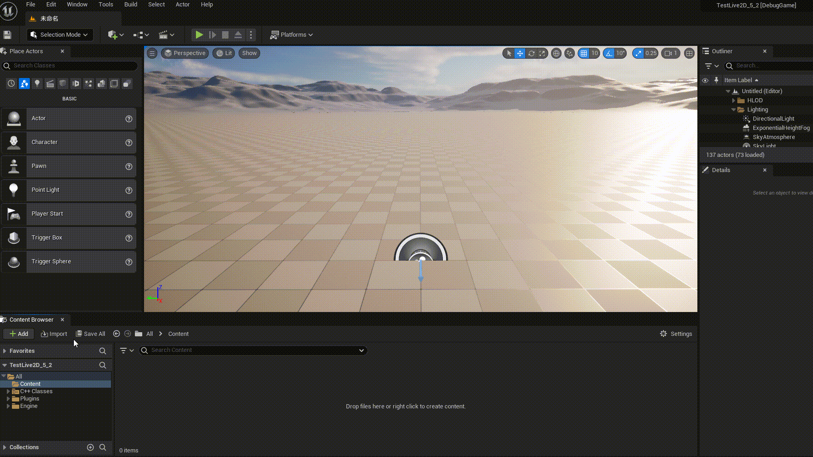

---
# UnLive2D - Unreal Engine Plugin

### Role：
It can make the Live2D model usable in UE4/5.

### Usage：
1. Download this plugin and place it in the `Plugins` file of the project
2. Need to download the official library [Cubism Native SDK](https://www.live2d.com/en/download/cubism-sdk/download-native/)To `./Source/ThirdParty/Live2DCubismCore`

### Downloadable Sample：
[Sample](https://www.live2d.com/learn/sample/)

### Currently Supported Functions：
#### Runtime:
1. Support Actor model display
2. Support UMG display
3. Support Live2D Animation/Emoticons/Physics

#### Editor:
1. Support preview of model editor
2. Support Live2D animation/emoji preview
3. Support emoji creation

#### Subsequent Development:
1. Animation Blueprints 
2. Animation Editing
3. Physical Editing
4. Mouth shape Editor

### Unreal Engine Version：

| Unreal Engine | Version |
| --- | --- |
| Unreal Editor 5.5  | 5.5.3  |
| Unreal Editor 5.4  | 5.4.4  |
| Unreal Editor 5.3  | 5.3.2  |
| Unreal Editor 5.2  | 5.2.1  |
| Unreal Editor 5.1  | 5.1.1  |
| Unreal Editor 5.0  | 5.0.3  |
| Unreal Editor 4.27 | 4.27.2 |

### Support Platform：

| Platform    | Is Testing |
| ---     |   ---   |
|  Win64  |  True  |
| Android |  True  |
|  Linux  |  False  |
|   Mac   |  False  |
|   IOS   |  False  |
