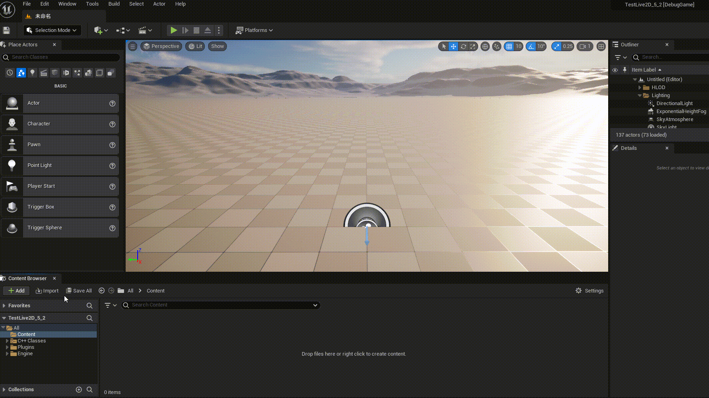

---
# UnLive2D - Unreal Engine Plugin

### 作用：
可以使得 Live2D 模型在UE4/5 中可以使用。

### 用法：
1. 下载此插件放入项目中的 Plugins 文件中
2. 需要下载官方库到 `./UnLive2DAsset/Source/ThirdParty/Live2DCubismCore` 下

### 目前支持功能：
#### Runtime:
1. 支持 Actor 模型展示
2. 支持 UMG 展示
3. 支持 Live2D 动画/表情/物理

#### Editor:
1. 支持模型编辑器预览
2. 支持Live2D动画/表情预览
3. 支持表情创建

#### 后续开发:
1. 动画蓝图
2. 动画编辑
3. 物理编辑
4. 口型编辑

### 支持虚幻版本：

| Unreal Engine | Version |
| --- | --- |
| Unreal Editor 5.4  | 5.4.4  |
| Unreal Editor 5.3  | 5.3.2  |
| Unreal Editor 5.2  | 5.2.1  |
| Unreal Editor 5.1  | 5.1.1  |
| Unreal Editor 5.0  | 5.0.3  |
| Unreal Editor 4.27 | 4.27.2 |

### 支持平台：

| 平台    | 是否测试 |
| ---     |   ---   |
|  Win64  |  已测试  |
| Android |  已测试  |
|  Linux  |  未测试  |
|   Mac   |  未测试  |
|   IOS   |  未测试  |
